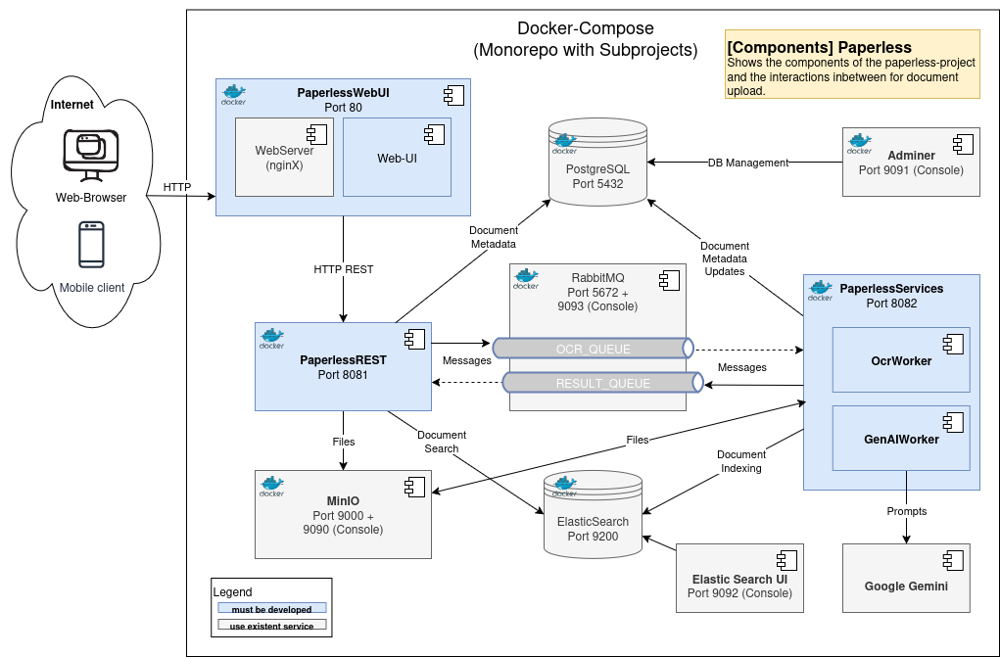

# Paperless - Document Management System

## Architecture



### Project Structure

```
SWEN3/
├── openapi/
│   ├── openapi.yaml              # API Specification
│   └── openapi-gen.sh            # Code Generation
│
├── PaperlessREST/                # REST API (Port 8081)
│   ├── src/main/java/com/fhtechnikum/paperless/
│   │   ├── controller/
│   │   ├── services/
│   │   ├── persistence/
│   │   ├── messaging/
│   │   └── PaperlessRestApplication.java
│   ├── src/main/resources/
│   │   └── application.properties
│   ├── Dockerfile
│   └── pom.xml
│
├── PaperlessServices/            # Worker Services (Port 8082)
│   ├── src/main/java/com/fhtechnikum/paperlessservices/
│   │   ├── consumer/
│   │   ├── config/
│   │   └── PaperlessServicesApplication.java
│   ├── src/main/resources/
│   │   └── application.properties
│   ├── Dockerfile
│   └── pom.xml
│
├── web-ui/                       # Frontend (Port 80)
│   ├── static/
│   ├── Dockerfile
│   └── nginx.conf
│
├── .env.sample                   # Environment template
├── docker-compose.yml
├── pom.xml
└── README.md
```

### Services

| Service | Port | Description |
|---------|------|-------------|
| web-ui | 80 | Frontend (nginx) |
| paperless-rest | 8081 | REST API Backend |
| paperless-services | 8082 | OCR Worker (Tesseract) |
| postgres | 5432 | PostgreSQL Database |
| queue | 5672, 15672 | RabbitMQ Message Broker |
| minio | 9000, 9090 | MinIO Object Storage |

## Prerequisites

- Java JDK 21+
- Maven 3.8+
- Docker Desktop
- Docker Compose
- Git

## Installation

### Clone Repository

```bash
git clone <repository-url>
cd SWEN3
```

### Environment Variables

All environment variables are configured in the `.env` file. The project includes a `.env.sample` file with default values for Docker Compose.

Copy and modify if needed:
```bash
cp .env.example .env
```

Default values from `.env.sample`:

```bash
# Database Configuration
POSTGRES_DB=paperless
POSTGRES_USER=paperless
POSTGRES_PASSWORD=paperless

# RabbitMQ Configuration
RABBITMQ_HOST=queue
RABBITMQ_PORT=5672
RABBITMQ_USER=guest
RABBITMQ_PASSWORD=guest

# Spring Datasource (for Docker)
SPRING_DATASOURCE_URL=jdbc:postgresql://postgres:5432/paperless
SPRING_DATASOURCE_USERNAME=paperless
SPRING_DATASOURCE_PASSWORD=paperless

# Spring RabbitMQ
SPRING_RABBITMQ_HOST=queue
SPRING_RABBITMQ_PORT=5672
SPRING_RABBITMQ_USERNAME=guest
SPRING_RABBITMQ_PASSWORD=guest
```

These values work out-of-the-box for Docker Compose. For local development without Docker, the `application.properties` files contain localhost defaults.

### Build Project

```bash
mvn clean install
```

### Build Docker Images

```bash
docker compose build
```

## Starting the Project

### With Docker Compose

```bash
docker compose up
```

All services start in foreground.

```bash
docker compose up -d
```

All services start in background.


## Access

After starting, the following URLs are available:

- Frontend: http://localhost:80
- REST API: http://localhost:8081
- RabbitMQ Management: http://localhost:15672 (guest/guest)
- MinIO Console: http://localhost:9090 (minioadmin/minioadmin)
- PostgreSQL: http://localhost:5432 (paperless/paperless)
- ElasticSearch: http://localhost:9200

